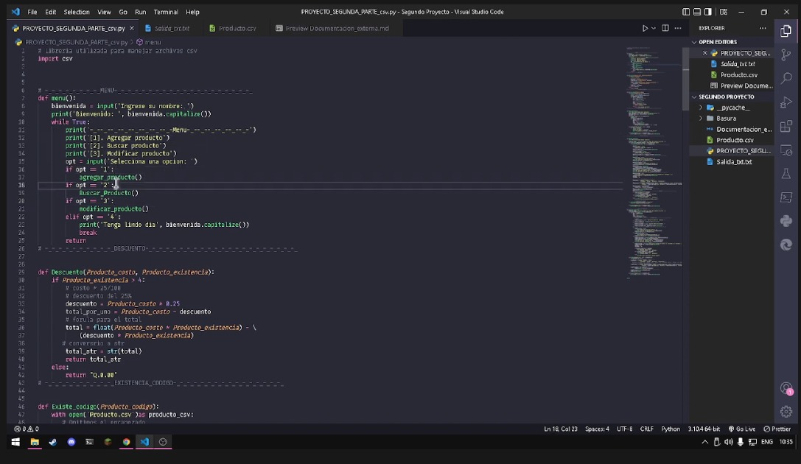

# Documentacion Externa: Segundo Proyecto(Sistema de Inventarios)

## **Proyecto desarrollado por:**
### Victor Alfredo Macario Enriquez 7690-22-5042
### Jefferson Ramiro Lopez Ramirez  7690-21-1522
### Roberto Antonio Ramírez Gómez   7690-22-12700
### José Miguel Arellano Bran       7690-22-5733
***

# Link GitHub:
https://github.com/Re-21-12/Algoritmos-Segundo-Proyecto

## **Documentacion externa sistema inventarios** _(Python)_

---
### Librerias
- En este caso se importo una libreria llamada csv, que nos permite manipular archivos con extension .csv
    ~~~
    import csv
    ~~~

### El menu
---
- Para la realizacion del menu, se uso una __funcion__ definida por:
  ~~~
  def menu():
    bienvenida = input('Ingrese su nombre: ')
    print('Bienvenido: ', bienvenida.capitalize())
    while True:
        print('-_--_--_--_--_--_--_--_-Menu-_--_--_--_--_--_-')
        print('[1]. Agregar producto')
        print('[2]. Buscar producto')
        print('[3]. Modificar producto')
        opt = input('Selecciona una opcion: ')
        if opt == '1':
            agregar_producto()
        if opt == '2':
            Buscar_Producto()
        elif opt == '3':
            print('Tenga lindo dia', bienvenida.capitalize())
            break
        return
  ~~~
     En esta funcion se genera un similar a __SwitchCase__ pero en _Python_ anidando una serie de opciones son _If's_ logrando de esta manera que si el ususario ingresa un numero: 1, 2 o una de las opciones disponibles lance otra funcion con la ejecucion del programa.
  
### El Descuento
---
- Para la realizacion del descuento se usaron dos _Parametros_ el primero: *Producto_Costo* y el segundo: *Producto_existencia* utilizando una regla cuando el producto a llevar sea mayor que 4 existencias entonces se realizara el descuento:
   ~~~
    def Descuento(Producto_costo,Producto_existencia):
    if Producto_existencia > 4:
        #costo * 25/100 
        #descuento del 25%
        descuento = Producto_costo * 0.25
        total_por_uno = Producto_costo - descuento
        #forula para el total
        total = float(Producto_costo * Producto_existencia) -(descuento * Producto_existencia)
       #conversrio a str
        total_str = str(total)
        return total_str
    else:
        return "Q.0.00"
   ~~~
    Agregado a ello luego de seguir la sentencia se establece un descuento del _25%_ al total de existencias y se le resta, para asi obtener el descuento total, de cumplir lo anterior regresara el _total_ si no regresara _Q.00_

### Existencia de codigo
---
- Para comprobar la existencia de un producto, la manera mas facil sera siempre comprobarlo a traves de una serie de numeros unicos, en este caso en un sistema alphanumerico que nos permita determinar la existencia del producto o productos; Para ello manipularemos a traves de una libreria anteriormente mencionada **Csv** un archivo de extension **.Csv** y lo leeremos fila por fila, luego lo filtraremos eliminando las filas vacias o los espacios que genera _Python_ de manera individual, luego a traves de una sentencia se realizada una busqueda en cada linea para determina; Si existe el parametro que se le paso en __Producto_Codigo__ dentro de la lista sin los espacios de no encontrarse se retornara _"No contiene esa serie"_
    ~~~
    def Existe_codigo(Producto_codigo):
    with open('Producto.csv')as producto_csv:
       #Omitimos el encabezado
       Lector = csv.DictReader(producto_csv)
       next(producto_csv, None)
       for Fila in producto_csv:
           #removemos salto de linea
           Fila = Fila.rstrip()
           #lo volemos un arreglo
           # sep == separadoro
           sep = ','
           lista = Fila.split(",")
           if Producto_codigo in lista:
               return "Ya existe"
           else:
               return "No contiene esa serie"
    ~~~

### Buscar un producto
---
- Para nosotros querer buscar un producto en nuestro _"Sistema"_, debemos :
    1. Ingresar nuestro producto a buscar.
    2. Capitalizar nuestro producto para facilitar la busqueda.
    3. Darle una salida a nuestro *(Opcional)*.
    4. Leer nuestro archivo.
    5. Indicar donde se encontro.
    6. Filtrar la busqueda para ser facilitada.
   
    Con los pasos mencionados anteriormente se realizo la siguiente funcion:
    ~~~
    def Buscar_Producto():
    print('Haz seleccionado buscar producto')
    buscar_producto = str(input("Ingrese el producto a buscar: "))
    buscar_producto_cap = buscar_producto.capitalize()
    escribir = []
    with open('Producto.csv')as producto_csv:
        palabra = 0
        next(producto_csv, None)
        for Fila in producto_csv:
            palabra += 1
            Fila = Fila.rstrip()
            sep = ','
            lista = Fila.split(",")
            if buscar_producto_cap in lista:
                escribir.append(str(palabra)+ " -> "+ Fila)
                
    with open("Salida_txt.txt", "w") as salida:
        for Fila in escribir:
            salida.write(Fila)
            print(" En linea: " + str(Fila))
            print("Su producto se enviara a: Salida_txt.txt")   
    ~~~
    Donde en dicha funcion se realizan todos los pasos mencionados anteriormente y la salida o el producto ingresado lo dirije a un archivo de salida .txt.

### Agregar un producto
---
- Para nosotros querer agregar un producto primero debemoms revisar si ese producto no se encuentra ya ingresado, para ello haremos uso de la funcion antes mencionada __Existe_codigo__ donde primeramente validaremos a traves de una variable pasandoselo como parametro a la funcion mencionada, para su posteriormente validacion, si este no existe dentro de nuestro sistema entonces, podemos continuar; Cabe mencionar que como queremos agregar un producto debemos hacer uso de: __El modo a+ de nuestra sintaxis with open__
para agregar un producto y no sobreescribirlo.

- A traves de una serie de variables con sus respectivos inputs, procederemos a ir ingresando uno por uno para ingresarlo a nuestro archivo **.Csv** pero para que se vea correctamente ingresado en nuestro archivo haremos uso de:
    1. Una lista llamada **Encabezados**
    2. Un diccionario para organizar de manera correcta la informacion.
    3. Una variable llamada **Producto_object** para escribir los datos ingresados con un formato.
    4. Usaremos la funcion **writerow** para escribirlo por lineas.
   
   ~~~
   ef agregar_producto():
    print('Haz seleccionado agregar producto')
    
    Producto_codigo = str(input('Ingrese el codigo del producto [A-z;1-9]: ')) 
    if Existe_codigo(Producto_codigo)=="No contiene esa serie":
     with open("Producto.csv", "a+") as producto_txt:    
            #-_--_--_--_--_--_--_--_--_--_-INFORMACIOCN-_--_--_--_--_--_--_--_--_--_-
                #nombre
                    Producto_nombre = input('Ingresa el nombre del  producto: ')
                #nombre con mayuscula
                    Producto_nombre_fix = Producto_nombre.capitalize()
                #nombre del proveedor
                    Producto_proveedor = input('Ingrese nombre del proveedor: ')
                #nombre del proveedor con mayuscula
                    Producto_proveedor_fix = Producto_proveedor.capitalize()
                #-_--_--_--_--_--_--_--_-DINERO-_--_--_--_--_--_--_--_--_--_--_--_-
                #el costo
                    Producto_costo = float(input('Ingrese el costo del producto: '))
                    print('El costo que ha ingresado es Q',Producto_costo)
                    Producto_costo_str = str(Producto_costo)
                #existencias del producto
                    Producto_existencia = int(input('Ingrese la cantidad de existencias: '))
                    Producto_existencia_str = str(Producto_existencia)
                #Descuento
                    Producto_Descuento = Descuento(Producto_costo,Producto_existencia)
                    Producto_Descuento_str = str(Producto_Descuento)
                    total_producto = str(Producto_costo * Producto_existencia)
                    print("El costo del producto total es: ", total_producto)
                    print("El descuento realizado es: ",Producto_Descuento )
                #-_--_--_--_--_--_--_--_--_--_-ESTADO-_--_--_--_--_--_--_--_--_--_--_-
                    Producto_estado = str(input('Seleccione el estado del producto: A = Aprobado |R = reprobado -> '))
                    Producto_estado_fix = Producto_estado.capitalize()
                    aprobado = "A" 
                    reprobado = "R"
                    
                #-_--_--_--_--_--_-Disenio-_--_--_--_--_--_-
                    encabezados = ['Codigo', 'Nombre','Costo', 'Proveedor', 'Estado', 'Descuento','Existencias']
                   # disenio = {'Codigo':'01', 'Nombre':'Juan', 'Costo': '10', 'Proveedor':'Maria', 'Estado': 'A', 'Descuento':'10', 'Existencias': '20'}
                    #-_-_-_-_-_-_Disenio_de_encabezado-_-_-_-_-_-_
                    Producto_dict = {'Codigo': Producto_codigo, 'Nombre':Producto_nombre_fix, 'Costo':Producto_costo_str,'Estado':Producto_estado_fix,'Proveedor':Producto_proveedor_fix, 'Descuento':Producto_Descuento_str,'Existencias':Producto_existencia_str}
                    #-_-_-_-_-_-_-_-_-_-_Leer_archivo_-_-_-_-_-_-_-_-_
                    Producto_object = csv.DictWriter(producto_txt, fieldnames=encabezados)  
                    #-_-_-_-_-_-_-_-_-_-_Escribir_arhivo-_-_-_-_-_-_-_-_
                    Producto_object.writerow(Producto_dict)
                    producto_txt.close()
                        #-_--_--_--_--_--_-LISTA-_--_--_--_--_--_--_--_--_--_--_--_-
                    if Producto_estado_fix == aprobado :
                            print('Usted ha seleccionado: '+'[',Producto_estado,']'+': Aprobado')
                    elif Producto_estado_fix == reprobado:
                            print('Usted ha seleccionado: '+'[',Producto_estado,']'+': Reprobado')
                    else:
                            print('Por favor seleccione un estado valido!')
                            
                            #valdiacion de codigo
    if Existe_codigo(Producto_codigo) == "Ya existe":
        print("El codigo contiene existencias")
   ~~~

### Modificar un producto
---
- Al modificar un producto se pueden utilizar variadas maneras de realizarsem a traves de archivos _temporales_, con _funciones replace_ o de la mas sencillas  _asignando nuevos datos a variables_ ya existentes; En este caso para fines practico se realizo la tercera, primeramente lo se debe realizar es una funcion en este caso llamada **Modificar_producto** donde primero Indexaremos nuestro codigo, es decir lo buscaremos en nuestro sistema, para ello se realizar un ciclo for y se va limpiando como se menciona en anteriores explicaciones, luego de ello similar a cuando buscamos por nombre validamos el codigo sin alterar su dato es decir buscamos en la fila donde se encuentra sin alterarlo.
  
- Seguidamente realizamos una serie de inputs o entradas con los datos a solicitar al usuario.

- Con otro _with open_ se realiza un **w+** para poder escribir y leer en nuestro archivo, junto a encabezados para identificar la posicion en la que se deben guardar los datos, usamoms tambien un diccionario para la nueva asignacion de valores, y a traves de la funcion *Dictwriter* lo transformamos en un objeto y se realizan las asignaciones correspondientes.

- Por ultimo realizamos un with open por default para que nos muestre los datos ingresados.

- De esta manera:
  ~~~
  def modificar_producto():
    Producto_codigo = str(input('Ingrese el codigo del producto [A-z;1-9]: '))
    with open('Producto.csv', "r+")as producto_csv:
        for Fila in producto_csv:
            Fila = Fila.rstrip()
            sep = ','
            lista = Fila.split(",")
            if Producto_codigo in lista:
                # -_--_--_--_--_--_--_--_--_--_-INFORMACIOCN-_--_--_--_--_--_--_--_--_--_-
                # nombre
                Producto_nombre = input( 'Ingresa el nombre del  producto: ')
            # nombre con mayuscula
                Producto_nombre_fix = Producto_nombre.capitalize()
            # nombre del proveedor
                Producto_proveedor = input( 'Ingrese nombre del proveedor: ')
            # nombre del proveedor con mayuscula
                Producto_proveedor_fix = Producto_proveedor.capitalize()
            # -_--_--_--_--_--_--_--_-DINERO-_--_--_--_--_--_--_--_--_--_--_--_-
            # el costo
                Producto_costo = float(
                    input('Ingrese el costo del producto: '))
                print('El costo que ha ingresado es Q', Producto_costo)
                Producto_costo_str = str(Producto_costo)
            # existencias del producto
                Producto_existencia = int(
                    input('Ingrese la cantidad de existencias: '))
                Producto_existencia_str = str(Producto_existencia)
            # Descuento
                Producto_Descuento = Descuento(Producto_costo, Producto_existencia)
                Producto_Descuento_str = str(Producto_Descuento)
                total_producto = str(Producto_costo * Producto_existencia)
                print("El costo del producto total es: ", total_producto)
                print("El descuento realizado es: ", Producto_Descuento)
            # -_--_--_--_--_--_--_--_--_--_-ESTADO-_--_--_--_--_--_--_--_--_--_--_-
                Producto_estado = str(input('Seleccione el estado del producto: A = Aprobado |R = reprobado -> '))
                Producto_estado_fix = Producto_estado.capitalize()
                aprobado = "A"
                reprobado = "R"

                if Producto_estado_fix == aprobado:
                    print('Usted ha seleccionado: ' +
                      '[', Producto_estado, ']'+': Aprobado')
                elif Producto_estado_fix == reprobado:
                    print('Usted ha seleccionado: ' +
                      '[', Producto_estado, ']'+': Reprobado')
                else:
                    print('Por favor seleccione un estado valido!')

    with open("Producto.csv", "w+") as producto_csv:
        next(producto_csv, None)
            # -_--_--_--_--_--_-Disenio-_--_--_--_--_--_-
        encabezados = ['Codigo', 'Nombre', 'Costo',
                           'Proveedor', 'Estado', 'Descuento', 'Existencias']
           # disenio = {'Codigo':'01', 'Nombre':'Juan', 'Costo': '10', 'Proveedor':'Maria', 'Estado': 'A', 'Descuento':'10', 'Existencias': '20'}
            # -_-_-_-_-_-_Disenio_de_encabezado-_-_-_-_-_-_
        Producto_dict = {'Codigo': Producto_codigo, 'Nombre': Producto_nombre_fix, 'Costo': Producto_costo_str, 'Estado': Producto_estado_fix,
                             'Proveedor': Producto_proveedor_fix, 'Descuento': Producto_Descuento_str, 'Existencias': Producto_existencia_str}
            # -_-_-_-_-_-_-_-_-_-_Leer_archivo_-_-_-_-_-_-_-_-_
        Producto_object = csv.DictWriter(
                producto_csv, fieldnames=encabezados)
            # -_-_-_-_-_-_-_-_-_-_Escribir_arhivo-_-_-_-_-_-_-_-_
        Producto_object.writerow(Producto_dict)
        producto_csv.close()
        
    with open("Producto.csv") as producto_txt:
       [print(linea.strip()) for linea in producto_txt.readlines()]
  ~~~
---
## **Codigo fuente** _(Python)_
~~~
# Libreria utilizada para manejar archivos csv
import csv

# -_-_-_-_-_-_-_-_MENU-_-_-_-_-_-_-_-_-_-_-_-_-_-_-_-_-_-_-_-_
def menu():
    bienvenida = input('Ingrese su nombre: ')
    print('Bienvenido: ', bienvenida.capitalize())
    while True:
        print('-_--_--_--_--_--_--_--_-Menu-_--_--_--_--_--_-')
        print('[1]. Agregar producto')
        print('[2]. Buscar producto')
        print('[3]. Modificar producto')
        opt = input('Selecciona una opcion: ')
        if opt == '1':
            agregar_producto()
        if opt == '2':
            Buscar_Producto()
        if opt == '3':
            modificar_producto()
        elif opt == '4':
            print('Tenga lindo dia', bienvenida.capitalize())
            break
        return
# -_-_-_-_-_-_-_-_-_-_DESCUENTO-_-_-_-_-_-_-_-_-_-_-_-_-_-_-_-_-_-_-_-_-_-_

def Descuento(Producto_costo, Producto_existencia):
    if Producto_existencia > 4:
        # costo * 25/100
        # descuento del 25%
        descuento = Producto_costo * 0.25
        total_por_uno = Producto_costo - descuento
        # forula para el total
        total = float(Producto_costo * Producto_existencia) - \
            (descuento * Producto_existencia)
       # conversrio a str
        total_str = str(total)
        return total_str
    else:
        return "Q.0.00"
# -_-_-_-_-_-_-_-_-_-_EXISTENCIA_CODIGO-_-_-_-_-_-_-_-_-_-_-_-_-_-_-_-_

def Existe_codigo(Producto_codigo):
    with open('Producto.csv')as producto_csv:
       # Omitimos el encabezado
        Lector = csv.DictReader(producto_csv)
        next(producto_csv, None)
        for Fila in producto_csv:
            # removemos salto de linea
            Fila = Fila.rstrip()
            # lo volemos un arreglo
            # sep == separadoro
            sep = ','
            lista = Fila.split(",")
            if Producto_codigo in lista:
                return "Ya existe"
            else:
                return "No contiene esa serie"
# -_-_-_-_-_-_-_-_-_-_BUSCAR_PRODUCTOS-_-_-_-_-_-_-_-_-_-_-_-_-_-_-_-_

def Buscar_Producto():
    print('Haz seleccionado buscar producto')
    buscar_producto = str(input("Ingrese el producto a buscar: "))
    buscar_producto_cap = buscar_producto.capitalize()
    escribir = []
    with open('Producto.csv')as producto_csv:
        palabra = 0
        next(producto_csv, None)
        for Fila in producto_csv:
            palabra += 1
            Fila = Fila.rstrip()
            sep = ','
            lista = Fila.split(",")
            if buscar_producto_cap in lista:
                escribir.append(str(palabra) + " -> " + Fila)

    with open("Salida_txt.txt", "w") as salida:
        for Fila in escribir:
            salida.write(Fila)
            print(" En linea: " + str(Fila))
            print("Su producto se enviara a: Salida_txt.txt")
    
    with open("Producto.csv") as producto_txt:
       [print(linea.strip()) for linea in producto_txt.readlines()]

# -_-_-_-_-_-_-_-_-_-_-_-_AGREGAR_PRODUCTOS-_-_-_-_-_-_-_-_-_-_-_-_-_-_-_-_

def agregar_producto():
    print('Haz seleccionado agregar producto')

    Producto_codigo = str(input('Ingrese el codigo del producto [A-z;1-9]: '))
    if Existe_codigo(Producto_codigo) == "No contiene esa serie":
        with open("Producto.csv", "a+") as producto_txt:
            # -_--_--_--_--_--_--_--_--_--_-INFORMACIOCN-_--_--_--_--_--_--_--_--_--_-
            # nombre
            Producto_nombre = input(
                'Ingresa el nombre del  producto: ')
            # nombre con mayuscula
            Producto_nombre_fix = Producto_nombre.capitalize()
            # nombre del proveedor
            Producto_proveedor = input(
                'Ingrese nombre del proveedor: ')
            # nombre del proveedor con mayuscula
            Producto_proveedor_fix = Producto_proveedor.capitalize()
            # -_--_--_--_--_--_--_--_-DINERO-_--_--_--_--_--_--_--_--_--_--_--_-
            # el costo
            Producto_costo = float(
                input('Ingrese el costo del producto: '))
            print('El costo que ha ingresado es Q', Producto_costo)
            Producto_costo_str = str(Producto_costo)
            # existencias del producto
            Producto_existencia = int(
                input('Ingrese la cantidad de existencias: '))
            Producto_existencia_str = str(Producto_existencia)
            # Descuento
            Producto_Descuento = Descuento(
                Producto_costo, Producto_existencia)
            Producto_Descuento_str = str(Producto_Descuento)
            total_producto = str(Producto_costo * Producto_existencia)
            print("El costo del producto total es: ", total_producto)
            print("El descuento realizado es: ", Producto_Descuento)
            # -_--_--_--_--_--_--_--_--_--_-ESTADO-_--_--_--_--_--_--_--_--_--_--_-
            Producto_estado = str(
                input('Seleccione el estado del producto: A = Aprobado |R = reprobado -> '))
            Producto_estado_fix = Producto_estado.capitalize()
            aprobado = "A"
            reprobado = "R"

            # -_--_--_--_--_--_-Disenio-_--_--_--_--_--_-
            encabezados = ['Codigo', 'Nombre', 'Costo',
                           'Proveedor', 'Estado', 'Descuento', 'Existencias']
            # -_-_-_-_-_-_Disenio_de_encabezado-_-_-_-_-_-_
            Producto_dict = {'Codigo': Producto_codigo, 'Nombre': Producto_nombre_fix, 'Costo': Producto_costo_str, 'Estado': Producto_estado_fix,
                             'Proveedor': Producto_proveedor_fix, 'Descuento': Producto_Descuento_str, 'Existencias': Producto_existencia_str}
            # -_-_-_-_-_-_-_-_-_-_Leer_archivo_-_-_-_-_-_-_-_-_
            Producto_object = csv.DictWriter(
                producto_txt, fieldnames=encabezados)
            # -_-_-_-_-_-_-_-_-_-_Escribir_arhivo-_-_-_-_-_-_-_-_
            Producto_object.writerow(Producto_dict)
            producto_txt.close()
            # -_--_--_--_--_--_-LISTA-_--_--_--_--_--_--_--_--_--ESTADO-_--_--_--_--_--_--_--_--_--_-
            if Producto_estado_fix == aprobado:
                print('Usted ha seleccionado: ' +
                      '[', Producto_estado, ']'+': Aprobado')
            elif Producto_estado_fix == reprobado:
                print('Usted ha seleccionado: ' +
                      '[', Producto_estado, ']'+': Reprobado')
            else:
                print('Por favor seleccione un estado valido!')

                # valdiacion de codigo
    if Existe_codigo(Producto_codigo) == "Ya existe":
        print("El codigo contiene existencias")

    with open("Producto.csv") as producto_txt:
       [print(linea.strip()) for linea in producto_txt.readlines()]

# -_-_-_-_-_-_-_-_-_-_MODIFICAR_PRODUCTOS-_-_-_-_-_-_-_-_-_-_-_-_-_-_-_-_
def modificar_producto():
    Producto_codigo = str(input('Ingrese el codigo del producto [A-z;1-9]: '))
    with open('Producto.csv', "r+")as producto_csv:
        for Fila in producto_csv:
            Fila = Fila.rstrip()
            sep = ','
            lista = Fila.split(",")
            if Producto_codigo in lista:
                # -_--_--_--_--_--_--_--_--_--_-INFORMACIOCN-_--_--_--_--_--_--_--_--_--_-
                # nombre
                Producto_nombre = input( 'Ingresa el nombre del  producto: ')
            # nombre con mayuscula
                Producto_nombre_fix = Producto_nombre.capitalize()
            # nombre del proveedor
                Producto_proveedor = input( 'Ingrese nombre del proveedor: ')
            # nombre del proveedor con mayuscula
                Producto_proveedor_fix = Producto_proveedor.capitalize()
            # -_--_--_--_--_--_--_--_-DINERO-_--_--_--_--_--_--_--_--_--_--_--_-
            # el costo
                Producto_costo = float(
                    input('Ingrese el costo del producto: '))
                print('El costo que ha ingresado es Q', Producto_costo)
                Producto_costo_str = str(Producto_costo)
            # existencias del producto
                Producto_existencia = int(
                    input('Ingrese la cantidad de existencias: '))
                Producto_existencia_str = str(Producto_existencia)
            # Descuento
                Producto_Descuento = Descuento(Producto_costo, Producto_existencia)
                Producto_Descuento_str = str(Producto_Descuento)
                total_producto = str(Producto_costo * Producto_existencia)
                print("El costo del producto total es: ", total_producto)
                print("El descuento realizado es: ", Producto_Descuento)
            # -_--_--_--_--_--_--_--_--_--_-ESTADO-_--_--_--_--_--_--_--_--_--_--_-
                Producto_estado = str(input('Seleccione el estado del producto: A = Aprobado |R = reprobado -> '))
                Producto_estado_fix = Producto_estado.capitalize()
                aprobado = "A"
                reprobado = "R"

                if Producto_estado_fix == aprobado:
                    print('Usted ha seleccionado: ' +
                      '[', Producto_estado, ']'+': Aprobado')
                elif Producto_estado_fix == reprobado:
                    print('Usted ha seleccionado: ' +
                      '[', Producto_estado, ']'+': Reprobado')
                else:
                    print('Por favor seleccione un estado valido!')

    with open("Producto.csv", "w+") as producto_csv:
        next(producto_csv, None)
            # -_--_--_--_--_--_-Disenio-_--_--_--_--_--_-
        encabezados = ['Codigo', 'Nombre', 'Costo',
                           'Proveedor', 'Estado', 'Descuento', 'Existencias']
           # disenio = {'Codigo':'01', 'Nombre':'Juan', 'Costo': '10', 'Proveedor':'Maria', 'Estado': 'A', 'Descuento':'10', 'Existencias': '20'}
            # -_-_-_-_-_-_Disenio_de_encabezado-_-_-_-_-_-_
        Producto_dict = {'Codigo': Producto_codigo, 'Nombre': Producto_nombre_fix, 'Costo': Producto_costo_str, 'Estado': Producto_estado_fix,
                             'Proveedor': Producto_proveedor_fix, 'Descuento': Producto_Descuento_str, 'Existencias': Producto_existencia_str}
            # -_-_-_-_-_-_-_-_-_-_Leer_archivo_-_-_-_-_-_-_-_-_
        Producto_object = csv.DictWriter(
                producto_csv, fieldnames=encabezados)
            # -_-_-_-_-_-_-_-_-_-_Escribir_arhivo-_-_-_-_-_-_-_-_
        Producto_object.writerow(Producto_dict)
        producto_csv.close()
        
    with open("Producto.csv") as producto_txt:
       [print(linea.strip()) for linea in producto_txt.readlines()]
        

menu()

~~~
---
## **Video en** _(Python)_

Haga click 

---
## **Captura de resultado en:** _(Python)_
  1. Agregar un producto 
  2. Buscar un producto .jpeg)
  3. Modificar un producto .jpeg)
  4. Producto Csv .jpeg)
  5. Salida Txt .jpeg)
   

***

## **Documentacion externa sistema inventarios** _(C++)_

## Las librerias

#include <iostream> : nos permite hacer uso del cin y el cout para obtener o imprimir valores. 

#include <fstream> : permite la manipulacion de archivos desde el programa, tanto leer y escribir en ellos. 

#include <windows.h> : contiene las declaraciones de todas las funciones de la biblioteca Windows API, todas las macros utilizadas por los programadores de aplicaciones para Windows, y todas las estructuras de datos utilizadas en gran cantidad de funciones y subsistemas.

## Manual principal

Esta parte del codigo nos permite seleccionar una opcion por elemplo: Agregar un producto, buscar producto, modificar los datos. 

int menu(){ 

int x; 

string nombre; 

system("cls"); 

cout<<" MENU "<<endl; 

cout<<" |------------------|"<<endl<<endl; 

cout<<" 1. AGREGAR PRODUCTO"<<endl; 

cout<<" 2. BUSCAR UN PRODUCTO"<<endl; 

cout<<" 3. MODIFICAR LOS DATOS DE UN PRODUCTO"<<endl; 

cout<<" 4. SALIR"<<endl<<endl;; 

cout<<" SELECCIONA UNA OPCION: "; 

cin>>x; 

return x; 

}

##### Este proceso verifica que si ya existe un codigo dentro del archivo, ya no lo ingresa nuevamente.

bool verifica (string cod){ 

ifstream leer("Productos.txt", ios::in); 

producto productos; 

leer>>productos.codigo; 

while(!leer.eof()){ 

leer>>productos.nombre; 

leer>>productos.precio; 

leer>>productos.proveedor; 

leer>>productos.existencia; 

leer>>productos.estado; 

leer>>productos.descuento; 

if(productos.codigo == cod){ 

cout<<endl; 

cout<<" ESTE CODIGO DE PRODUCTO YA EXISTE, POR FAVOR INGRESE UNO NUEVO..."<<endl; 

cout<<endl; 

leer.close(); 

system("pause"); 

return false; 

} 

leer>>productos.codigo; 

} 

leer.close(); 

return true; 

}

## Funcion agregar

Esta funcion nos permite ingresar productos al archivo llamados prodectos.txt con todos sus atributos como su nombre,descuento y codigo etc. 

void agregar(ofstream &escribir){ 

system("cls"); 

producto productos; 

escribir.open("Productos.txt", ios::out | ios::app); 

cout<<" AGREGAR PRODUCTO"<<endl<<endl; 

cout<<" INGRESE EL CODIGO DEL PRODUCTO: "; 

cin>>productos.codigo; 

cout<<" INGRESE EL NOMBRE DEL PRODUCTO: "; 

cin>>productos.nombre; 

cout<<" INGRESE EL PRECIO DEL PRODUCTO (Q): "; 

cin>>productos.precio; 

fflush(stdin); 

cout<<" INGRESE EL PROVEEDOR DEL PRODUCTO: "; 

cin>>productos.proveedor; 

cout<<" INGRESE LA EXISTENCIA DEL PRODUCTO (UNIDADES): "; 

cin>>productos.existencia; 

fflush(stdin); 

cout<<" INGRESE EL ESTADO DEL PRODUCTO (A = APROVADO R = REPROVADO): "; 

cin>>productos.estado; 

cout<<" INGRESE EL DESCUENTO DEL PRODUCTO (%): "; 

cin>>productos.descuento; 

fflush(stdin); 

cout<<endl; 

if(verifica(productos.codigo)) 

escribir << productos.codigo << " "<< productos.nombre << " "<< productos.precio << " " << productos.proveedor << " " << productos.existencia << " " << productos.estado << " "<< productos.descuento<<endl; 

escribir.close(); 

}

## Funcion buscar

Este proceso nos permite buscar el producto que sea necesario buscar con todos sus atributos. 

void buscar(ifstream &lectura){ 

system("cls"); 

lectura.open("Productos.txt", ios::in); 

producto productos; 

bool encontrado = false; 

string codigo; 

cout<<" BUSCAR "<<endl<<endl; 

cout<<" INGRESE EL CODIGO DEL PRODUCTO QUE DESEA BUSCAR: "; 

cin>>codigo; 

cout<<endl; 

lectura>>productos.codigo; 

while(!lectura.eof() && !encontrado){ 

lectura>>productos.nombre; 

lectura>>productos.precio; 

lectura>>productos.proveedor; 

lectura>>productos.existencia; 

lectura>>productos.estado; 

lectura>>productos.descuento; 

if(productos.codigo == codigo){ 

cout<<" CODIGO: "<<productos.codigo<<endl; 

cout<<" NOMBRE: "<<productos.nombre<<endl; 

cout<<" PRECIO (Q): "<<productos.precio<<endl; 

cout<<" PROVEEDOR: "<<productos.proveedor<<endl; 

cout<<" EXISTENCIA (U): "<<productos.existencia<<endl; 

cout<<" ESTADO: "<<productos.estado<<endl; 

cout<<" DESCUENTO (%): "<<productos.descuento<<endl<<endl; 

encontrado = true; 

} 

lectura>>productos.codigo; 

} 

lectura.close(); 

if(!encontrado) 

cout<<" PRODUCTO NO ENCONTRADO "<<endl<<endl; 

system("pause"); 

}

## Funcion modificar

Esta funcion nos permite cambiar o modificar los atribustos del producto que se requeira modificar. 

void modificar(ifstream &lectura){ 

system("cls"); 

string ncodigo; 

string nnombre; 

float nprecio; 

string nproveedor; 

int nexistencia; 

string nestado; 

float ndescuento; 

producto productos; 

lectura.open("Productos.txt", ios::in); 

ofstream auxiliar("auxiliar.txt", ios::out); 

if(lectura.is_open()){ 

cout<<" MODIFICAR LOS ATRIBUTOS DE UN CODIGO "<<endl<<endl; 

cout<<" INGRESE EL CODIGO DEL PRODUCTO QUE DESEA MODIFICAR: "; 

cin>>ncodigo; 

cout<<endl; 

lectura>>productos.codigo; 

while(!lectura.eof()){ 

lectura>>productos.nombre; 

lectura>>productos.precio; 

lectura>>productos.proveedor; 

lectura>>productos.existencia; 

lectura>>productos.estado; 

lectura>>productos.descuento; 

if(productos.codigo == ncodigo){ 

cout<<" NUEVO NOMBRE DEL PRODUCTO: "; 

cin>>nnombre; 

cout<<" NUEVO PRECIO DEL PRODUCTO (Q): "; 

cin>>nprecio; 

cout<<" NUEVO PROVEEDOR DEL PRODUCTO: "; 

cin>>nproveedor; 

cout<<" NUEVA EXISTENCIA DEL PRODUCTO (u): "; 

cin>>nexistencia; 

cout<<" NUEVO ESTADO DEL PRODUCTO: "; 

cin>>nestado; 

cout<<" NUEVO DUSCUENTO DEL PRODUCTO (%): "; 

cin>>ndescuento; 

cout<<endl; 

cout<<" EL PRODUCTO SE MODIFICO EXITOSAMENTE"<<endl<<endl; 

system("pause"); 

auxiliar<<productos.codigo<<" "<<nnombre<<" "<<nprecio<<" "<<nproveedor<<" "<<nexistencia<<" "<<nestado<<" "<<ndescuento<<endl; 

}else{ 

auxiliar << productos.codigo << " "<< productos.nombre << " "<< productos.precio << " " << productos.proveedor << " " << productos.existencia << " " << productos.estado << " "<< productos.descuento<<endl; 

} 

lectura>>productos.codigo; 

} 

lectura.close(); 

auxiliar.close(); 

}else 

cout<<" ¡NOS SE PUDO ABRIR EL ARCHIVO!"; 

remove("Productos.txt"); 

rename("auxiliar.txt", "Productos.txt"); 

}

## Funcion principal

En esta funcion es para busacar y agregar el prodecto para que nos muestre el usuario. 

int main(){ 

struct producto productos; 

ofstream escribir; 

ifstream lectura; 

int opcion; 

do{ 

system("cls"); 

opcion = menu(); 

switch(opcion){ 

case 1: 

agregar(escribir); 

break; 

case 2: 

buscar(lectura); 

break; 

case 3: 

modificar(lectura); 

break; 

case 4: 

return 0; 

break; 

} 

}while(opcion != 4); 

return 0; 

}

## **Video en** _(C++)_

Haga click 

## **Captura de resultado en:** _(C++)_
 1. Agregar un producto 
 2. Salida del producto a txt 
 3. Buscar un producto 
 4. Modificar un producto 

